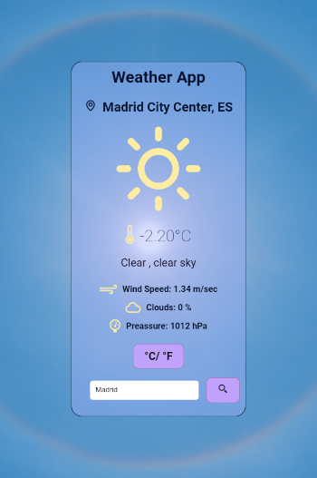
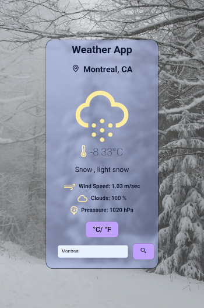
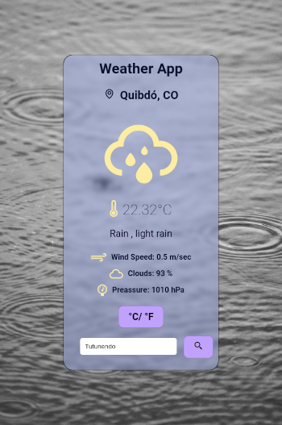
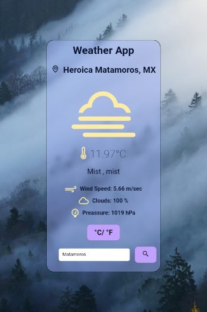
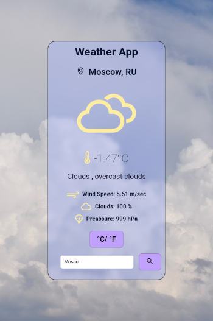

# Weather App

Aplicación que muestra el clima de la ubicación actual.

- Escrita en React.
- Usando la API de OpenWatherMap.
- Fuente Weather Icons.
- Fuente BoxIcons.
- Fuente Roboto.
- Imágenes de Unsplash y Pixabay.

URL de despliegue:
[Netlify](https://genuine-crostata-b97608.netlify.app)

## Imágenes

*Clear Sky*

*Snowing*

*Raining*

*Fog*

*Clouds*